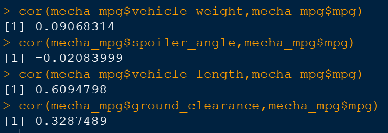
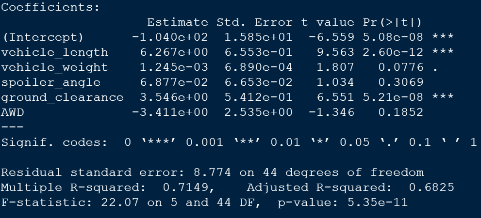
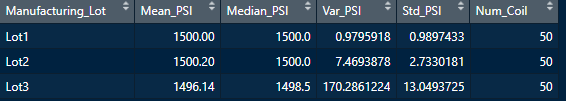
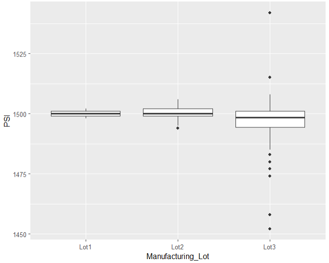
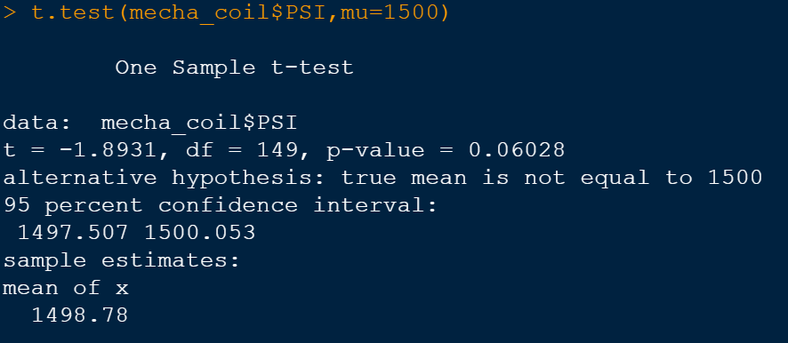
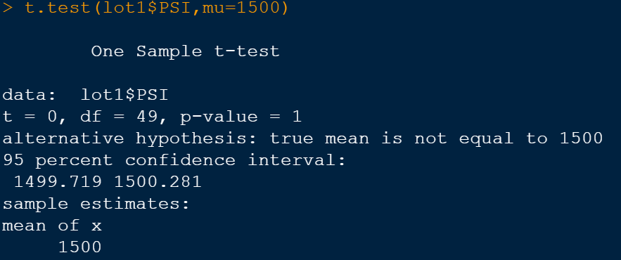
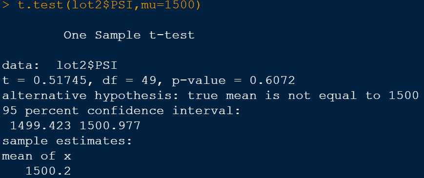
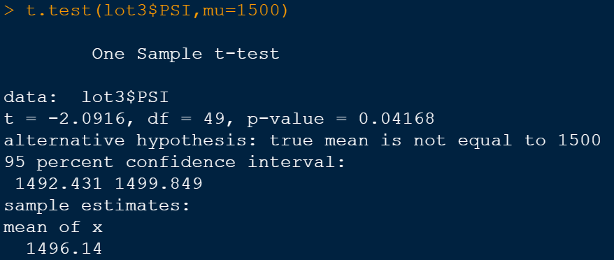

# MechaCar_Statistical_Analysis using R

**Scenario:**

AutosRUs’ newest prototype, the MechaCar, is suffering from production troubles that are blocking the manufacturing team’s progress. AutosRUs’ upper management has called on the data analytics team to review the production data for insights that may help the manufacturing team.

**Deliverable 1**

**Hypothesis:**

The null hypothesis is ,there is zero percent correlation or relationship between the dependent variable(mpg) and the independent variable(s) and the alternative hypothesis is there is more than zero percent correlation or relationship between the dependant and independant variables.

In general the researchers try to reject the null hypothesis and prove the alternate hypothesis,Two variables show high correlation numbers Vehicle length and ground clearance, so it’s safe to say that we can reject our null hypothesis. 

**1.Which variables/coefficients provided a non-random amount of variance to the mpg values in the dataset?**

From the output of the linear model, we see that vehicle length and ground clearance has the highest impact on predicting mpg with very small p-values(R uses scientific e notation where e tells you to multiple the base number by 10 raised to the power shown so 2.60e-12 is smaller number than 0.0776 ), they also have high correlation percentage.

 
**2.Is the slope of the linear model considered to be zero? Why or why not?**

If the slope is zero ,it means the points between two variables are random, and there is no relationship between them. From the equation of the linear model, we see that all coefficients of our predictor variables are non-zero, therefore the slope of our linear model is non-zero. 

**3.Does this linear model predict mpg of MechaCar prototypes effectively? Why or why not?**

Lower R squared values correspond to models with more error, which in turn produces predictions that are less precise. In other words, if your R squared is too low, your predictions will be too imprecise to be useful.Our R squared value is 71% with all the variables, this mean this model predicts with 71% accuracy, I would say this should be improved , we do need a decent 90% to be really confident on the model and carry forward with the production.

**Deliverable 2**

The MechaCar “Suspension_Coil.csv” dataset contains the results from multiple production lots. In this dataset, the weight capacities of multiple suspension coils were tested to determine if the manufacturing process is consistent across production lots.

The design specifications for the MechaCar suspension coils dictate that the variance of the suspension coils must not exceed 100 pounds per square inch.Total summary PSI variance shows 62.29 , however when we see the lot summary lot3 has a higher than normal variance at 170.28.

Box plot also shows Lot3 has too many outliers 

**Deliverable 3**

Performing t.test() function to determine if the PSI across all manufacturing lots , and they are statistically different from the population mean of 1,500 pounds per square inch.

For lot 1 and lot 2 and lot 3 the p value are 1, 0.60 , 0.04 respectively, The smaller the p-value, the stronger the evidence that you should reject the null hypothesis. A p-value less than 0.05 (typically ≤ 0.05) is statistically significant only lot 3 fits that definition. If the p-value is below your threshold of significance (typically p < 0.05), you can reject the null hypothesis, but this does not mean that there is a 95% probability that the alternative hypothesis is true. 

## Study Design: MechaCar vs Competition.

We do not have exact data to test the performance of the competition in this analysis, however its standard practice to do a comparative study before releasing a new product in any industry, in this case a car. Cost and/or fuel efficiency are two good variables to start the analysis.

Examples of hypothesis, Null Hyothesis: Cost per ride of MechaCar is greater than or equal to competition vehicle. Alternative Hypothesis: Cost per ride of MechaCar is less than competition vehicle

Two sample t-test is a good starting point to see if there is any difference in both brands cost and fuel efficiency. we do need a decent sample data which is normally distributed for both MechaCar and its competition Vehicle to carry out a meaningful analysis.
